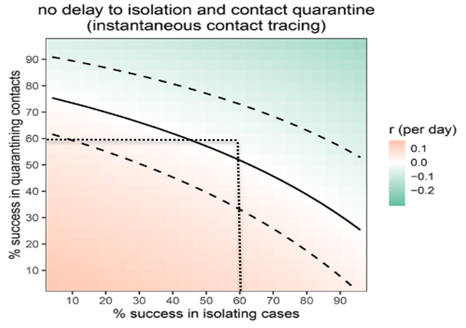
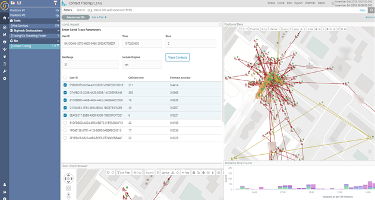

**Les technologies de renseignement ont aidé plusieurs nations lors de l’apparition du COVID-19. Dans cet article, j’aborde certains des défis posés par les données ainsi que l’espoir de passer d’un suivi d’urgence à une “mise à distance sociale intelligente”, durable et axée sur la protection de la vie privée.**

En introduction dans [“Les Guides de la CNIL pour la Sécurité des Données Personnelles”](https://www.cnil.fr/fr/un-nouveau-guide-de-la-securite-des-donnees-personnelles) il est précisé que “La gestion des risques permet de déterminer les précautions à prendre « au regard de la nature des données et des risques présentés par le traitement, pour préserver la sécurité des données » (article 34 de la loi du 6 janvier 1978 modifiée, dite loi Informatique et Libertés).

Le règlement européen 2016/679 du 27 avril 2016 (dit « règlement général sur la protection des données » ou RGPD) précise que la protection des données personnelles nécessite de prendre des « mesures techniques et organisationnelles appropriées afin de garantir un niveau de sécurité adapté au risque » (article 32).”

J’ai récemment appris qu’un déploiement de Siren, jusqu’alors utilisé pour la sureté nationale, a été détourné de son utilisation première et fortement utilisé pour lutter contre la propagation de COVID-19 dans le pays d’un client.

Lors de l’apparition de l’épidémie de COVID-19, ce client, [comme beaucoup d’autres](https://techcrunch.com/2020/03/18/israel-passes-emergency-law-to-use-mobile-data-for-covid-19-contact-tracing/), a rapidement pris la décision d’effectuer un suivi des cas de COVID-19 et de procéder à un “tracking de contacts” en réutilisant les mêmes technologies.

En déterminant le lieu où se trouvaient les personnes potentiellement infectées, ainsi que les personnes avec lesquelles elles avaient partagé un moment de proximité physique significatif, des recommandations d’auto-isolement ont été émises et des tests ont été programmés. À ce jour, les efforts du pays en question semblent avoir porté leurs fruits.

Dans cet article, nous passerons en revue certains des facteurs qui influent sur le « contact tracing » (ci-dessous appelé « recherche des contacts ») et comment ce dispositif est susceptible d’évoluer.

##**Qu’est-ce que c’est (et est-ce que ça fonctionne vraiment) ?**

Le but de la recherche des contacts est de trouver et éventuellement de notifier les citoyens susceptibles de présenter un haut risque d’infection par la COVID-19. Le principe étant que les personnes à haut risque sont celles qui se sont trouvées à moins de deux mètres pendant 15 minutes ou plus, avec une personne infectée connue, au cours des quatre dernières semaines ([d’après les directives actuelles du HSE (Irlande)](https://www2.hse.ie/conditions/coronavirus/coronavirus.html) ou encore d’après le site officiel du [Gouvernement en France](https://www.gouvernement.fr/info-coronavirus)).

Les lignes directrices précisent également que nous ne recherchons pas les personnes croisées dans la rue par hasard, car la probabilité de contamination est très faible dans ce cas.

Cela fonctionne-t-il vraiment ?

On peut légitimement poser la question suivante : dans le cas d’un virus qui n’est symptomatique que dans une relativement faible fraction des cas, la recherche des contacts fonctionne-t-elle réellement ?

Il s’avère que oui, la recherche à échelle peut fonctionner pour le COVID-19 et les virus aux caractéristiques semblables.

Cet [article](https://science.sciencemag.org/content/early/2020/03/30/science.abb6936) très récent (Science) simule les effets de la recherche des contacts afin de montrer le potentiel relatif à l’arrêt et à l’inversion de la courbe de croissance d’un virus tel que le COVID-19.

Dans le graphique ci-dessous, nous pouvons voir que lorsqu’un système entièrement automatisé est déployé à grande échelle, la dynamique épidémique entre dans la “zone verte” décroissante (en haut à droite pour les daltoniens comme moi) même lorsqu’on ne peut pas déterminer précisément les cas positifs ou les contacts (précision de 60% dans chaque cas).

À noter que le document ne précise pas sur quel principe technologique le traçage doit reposer (application pour téléphone portable, traçage de localisation en masse des téléphones, etc…), ce qui amène la question suivante:

##**Quelles sont les options technologiques disponibles pour la recherche des contacts ?**

Il existe de nombreuses façons de géolocaliser des personnes, des systèmes extrêmes et Orwelliens à d’autres solutions plus astucieuses qui permettent de déduire que deux personnes ont pu être en contact car elles émettaient un trafic depuis la même adresse IP, elle-même associée à un petit bureau.

Cependant, pour que le traçage fonctionne correctement, les méthodes doivent fonctionner à l’échelle et il n’y a selon moi que deux approches possibles :
- Les données des opérateurs de téléphonie mobile
- Des applications mobiles spécifiques avec la détection des contacts à distance réduite, reposant sur Bluetooth par exemple.

À propos des données des opérateurs de téléphonie mobile ; une croyance assez répandue voudrait que les opérateurs disposent de la position de leurs abonnés à tout moment, ce qui est, dans de nombreux cas, tout à fait erroné.

D’une part, techniquement, les opérateurs de téléphonie mobile pourraient améliorer [leurs systèmes de support opérationnel](https://en.wikipedia.org/wiki/Operations_support_system) avec des logiciels qui utilisent la télémétrie par antenne — lecture continue de la puissance des nombreuses antennes qui parlent en même temps au même combiné 3g/4g — afin de déterminer une position approximative pour chaque abonné (100m est une estimation correcte).

Dans les faits, les opérateurs ne le font pas à moins d’y être obligés par la législation et se limitent généralement à fournir des données “tour de téléphonie”, c’est-à-dire les coordonnées de l’antenne téléphonique la plus proche.

D’autres solutions techniques peuvent, d’une certaine façon, contourner les opérateurs de téléphonie mobile et obtenir une précision similaire voire supérieure, mais ces dernières relèvent du renseignement et sont susceptibles d’être contestées si de meilleures méthodes ne sont pas disponibles.

Techniquement parlant, les applications pour téléphones portables sont, en théorie, les meilleures sources possibles d’informations pour la recherche de contacts : elles ont accès au positionnement le plus précis (généralement en combinant les données du GPS, du wifi et d’autres informations) et disposent notamment de capacités Bluetooth, qui constituent peut-être le meilleur équilibre actuel entre confidentialité et efficacité.

Mais même avec des applications en tant que sources, les données sont loin d’être parfaites ou faciles à interpréter. Les listes de contacts Bluetooth peuvent être infinies, et les données GPS nécessitent un traitement minutieux pour dissocier le signal du bruit.

Ci-dessous, une capture d’écran d’un exercice de recherche de contacts COVID-19 avec Siren utilisant des données de positionnement anonymisées, combinant GPS et téléphone, disponibles dans le commerce. Comme on peut le voir, les traces sont loin d’être précises, mais le traitement du signal fait ressortir les “meilleurs candidats”.

Les citoyens vont-ils coopérer ?

Le problème des applications est qu’elles nécessitent généralement la coopération d’une population : les personnes doivent télécharger l’application, elles doivent également toutes accepter d’utiliser la même.

Si ce n’est pas un problème pour des pays tels que la Chine — où l’application a simplement été glissée dans les mises à jour d’applications de paiement et de chat les plus communément utilisés — ce sera le cas dans de nombreux autres pays pour lesquels les données de télécommunications à grande échelle constitueraient une voie de choix.

##**De la recherche de contacts d’urgence à la “distance sociale intelligente” (Smart Social Distancing)**

À mesure que la crise du COVID-19 se stabilisera, il est probable que nous observerons un tournant dans les comportements et passerons des réactions d’urgence, au cours desquelles des technologies relevant du renseignement ont également été employées, à des efforts dirigés vers la construction d’un avenir stable et durable avec pour considération première, la protection de la vie privée.

Le terme que vous entendrez peut-être le plus souvent à l’avenir est celui de “Smart Social Distancing”, qui fait référence à une combinaison de technologie, d’intelligence artificielle et de comportement citoyen raisonnable et qui deviendra certainement la norme le temps de surmonter la crise du COVID-19, mais également pour ne plus être pris au dépourvu en cas de menaces futures.

En conclusion : OUI nous pouvons protéger les données personnelles pour construire un système de traçabilité pour rechercher des personnes potentiellement infectées par le virus afin d’aider les gouvernements à localiser, tracer et à prendre des mesures pour éviter la propagation du virus et aussi pour cibler les tests et les soins.

À ce jour, nous sommes très fiers que la solution de notre partenaire Siren ait fait sa part, au moins dans la première phase de cette crise. Et si vous voulez parler Renseignements et Investigations Numériques, nous sommes là pour vous aider.

> [Post original](https://www.linkedin.com/pulse/contact-tracing-covid-19-methods-efficacy-future-giovanni-tummarello/) par Giovanni Tummarello, Mercredi 1 Avril 2020