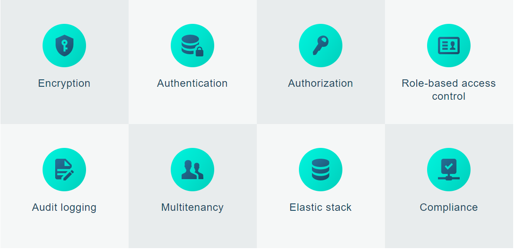

Avec 5,1 milliards de fichiers exposés détectés, la France se place devant la Chine et les U.S.A dans la liste des pays recensant le plus de données exposées, d'après une étude* menée sur les bases de données Elasticsearch et Mongodb qui constituent parmi les outils les plus puissants et les plus répandus dans l'industrie du Big data.

Nombre d'organisations privées comme publiques ne savent pas que la totalité de leurs bases de données est, à l'heure ou nous écrivons, exposée et recensée sur des plateformes telles que [Shodan](https://www.linkedin.com/pulse/comment-les-hackers-peuvent-ils-trouver-vos-clusters-expos%25C3%25A9s-el-bazi/?lipi=urn%3Ali%3Apage%3Ad_flagship3_pulse_read%3B%2BZtuIt%2F0QHqut4eqDTT7RQ%3D%3D). Une plateforme en libre accès ou mal configurée a une durée de vie de 8 heures **avant d'être compromise, volée, rançonnée ou simplement effacée**.

Il est urgent que toutes les organisations qui sous-traitent ou internalisent le déploiement de ces plateformes Big data posent la question de leur sécurité.

Car malgré ce que pourrait laisser penser la multitude et la fréquence des fuites de données impliquant ces plateformes, elles ne sont pas une fatalité, le problème est bel et bien soluble et la solution est open source et gratuite depuis près de [7 ans](https://github.com/salyh/elasticsearch-security-plugin/commit/1d52068b0163f4994120a886c95f7de2e04cb5d8) : que ces problèmes majeurs soient rencontrés et se reproduisent sans fin est encore moins compréhensible.

Des technologies [open source](https://youtu.be/ewM9glvw0E4) permettant d'apporter la sécurité basique existent depuis 2013. Elles ne sont malheureusement pas toujours connues ou mises en place, dans la précipitation des développements. Elles se perdent dans les confusions relatives à la responsabilité partagée de la sécurité du cloud ("seulement 32% des entreprises pensent être responsables de la protection de leurs données sur le cloud"****), ou succombent devant le manque de discernement de prestataires qui se reposent parfois sur des stagiaires (qui ne sont pas à blamer : ils font leurs premiers pas dans ces technologies et il revient bien [aux prestataires de prendre leurs responsabilités au sérieux](https://www.linkedin.com/pulse/questions-de-confiance-et-responsabilit%C3%A9s-pour-la-vos-corselis/?lipi=urn%3Ali%3Apage%3Ad_flagship3_pulse_read%3B%2BZtuIt%2F0QHqut4eqDTT7RQ%3D%3D)).

Les quelques solutions disponibles ancrées dans [la communauté open source](https://search-guard.com/security-means-open-source-by-definition/) comportent ainsi une offre basique (mais essentielle), gratuite, qui sauvent les clusters de données des pattes du premier script malveillant venu.

Pour aller plus loin : des fonctionnalités plus abouties existent qui faciliteraient la cartographie des données en permettant, par exemple, de savoir de façon précise qui a accédé à quelles données et quand.

**Quelques une des fonctionnalités qui permettent aux organisations de savoir si leurs bases de données sont soumises aux regards indiscrets, et de remédier au problème** :
### Fonctionnalités de conformité:

1. Historique de lecture

Permet de connaître exactement quels champs dans les documents ont été consultés, et par quel utilisateur.

Cette fonctionnalité aide à répondre à plusieurs points de conformité imposés par le Règlement Général sur la Protection des Données.

Le RGPD impose en effet d’informer les utilisateurs ou clients de qui, dans l'entreprise, peut accéder à leurs données personnelles et à quelles fins. [L'historique de lecture](https://docs.search-guard.com/latest/compliance-read-history) permet de surveiller et de tracer l’accès éventuel aux données et détails confidentiels (prénom, nom, adresse mail, etc...) et de stocker ces données de logs à des fins de consultations dans Elasticsearch, Kafka, Cassandra ou autre...

2. Historique d’écriture

De façon similaire, [l'historique d'écriture](https://docs.search-guard.com/latest/compliance-write-history) permet de retracer la création ou la suppression de documents ainsi que tout traitement réalisé sur un document dans un cluster Elasticsearch.

Il est possible d'enregistrer les modifications (format « JSON patch ») afin de savoir comment un document a été modifié au cours du temps, ce qui est utile dans le cas des données personnelles identifiables (PII), car peuvent vous être demandés :

- Des renseignements concernant quelles données personnelles identifiables sont stockées
- Des renseignements concernant la date de création des données
- L' apport de modifications aux données personnelles identifiables
- La suppression des données conformément au droit à l’oubli 

Une historique d’écriture permet de garder une trace d’audit pour tous ces événements et de la mettre à disposition rapidement.

3. Anonymisation des champs

[La sécurité au niveau des champs](https://docs.search-guard.com/latest/field-level-security) permet de filtrer les champs sensibles dans les documents.

Dans certains cas vous pouvez avoir besoin d’anonymiser des champs plutôt que de les enlever, vous préférerez dans ce cas remplacer la valeur en texte clair par un hash qui empêche les personnes non autorisées de consulter les données.

L’anonymisation est facile à utiliser et à configurer et a également un impact sur la mise en conformité : les données anonymisées ne sont plus des données personnelles identifiables.

Autrement dit, si un utilisateur ne voit que la version hash des données en texte clair, plusieurs règles de conformité ne s’appliquent plus. 

4. Indices immuables – Intégrité des données

Deux fonctionnalités clés pour protéger l’intégrité de vos données : les certificats TLS permettent de s'assurer que vos données ne seront pas modifiées pendant leur transit. En implémentant le contrôle d’accès basé sur les rôles, il est possible de préciser quels utilisateurs ont le droit de créer, modifier ou supprimer des données.

Avec [les indices immuables](https://docs.search-guard.com/latest/immutable-indices), l’intégrité des données passe au niveau supérieur.

Si un indice est marqué comme immuable, il est possible de créer des documents (ex: journaux de logs) qui ne pourront plus jamais être modifiés : vous êtes assurés de la fiabilité des données de consultation et un tiers ne pourra pas effacer les traces de consultations injustifiées.

C'est la technique dite « write-once read-many », qui vous est utile si vous devez vous assurer que les données ne peuvent pas être modifiées une fois enregistrées. Toutes sortes d’événement d’audit et de conformité compris – une fois écrites, seront gravées dans le marbre.

En outre, il est possible d'interdire ces opérations :

- Supprimer l’indice
- Ouvrir et fermer l’indice
- Réindexer l’indice
- Restaurer à partir de snapshots
- Routage d’événements d’audit

Il est possible de stocker des événements d’audit dans plusieurs points d’accès, y compris Elasticsearch, Webhooks, Kafka, Cassandra, etc... et d'envoyer tous les événements de sécurité, par exemple des tentatives de connexion échouées ou privilèges manquants, à un système SIEM. 

Et vous, savez-vous quelle plateforme est utilisée par votre entreprise / votre client pour stocker et gérer ses données ? Qui s'assure de sa sécurité ? Le sujet semble évident, mais mérite d'être abordé...

[Search Guard](https://www.linkedin.com/company/search-guard/?lipi=urn%3Ali%3Apage%3Ad_flagship3_pulse_read%3B%2BZtuIt%2F0QHqut4eqDTT7RQ%3D%3D) est la plus ancienne et la plus pointue des solutions de sécurité pour Elasticsearch. Elle est également la seule solution aussi complète à être entièrement Open Source / Open code sous licence Apache 2. La team Search Guard est une équipe qui croit en l'Open Source, au logiciel libre et à l'esprit de partage ainsi que dans le bien fondé d'une sécurité accessible à tous et à toutes, donc d'abord, ouverte et gratuite. Plus de détails techniques sur les fonctionnalités sont disponibles ici.

