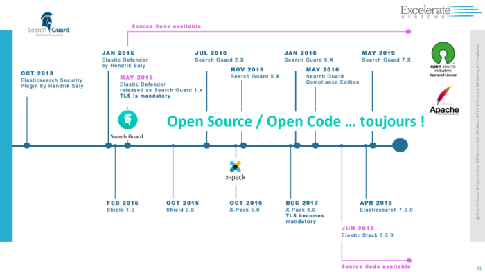

Nous apprécions tous Elasticsearch pour l'indexation et la recherche des données. Et ce malgré un défaut fondamental depuis sa création : Aucune brique de sécurité !
Beaucoup d'installations d'Elasticsearch sont aujourd’hui les cibles d’attaques et ce au niveau mondial et encore très récemment, entraînant [des atteintes massives](https://techcrunch.com/2019/05/03/china-smart-city-exposed/?guccounter=1) aux données personnelles, [encore](https://www.infosecurity-magazine.com/news/elasticsearch-snafu-exposes-data), et [encore](https://securitydiscovery.com/panama-citizens-massive-data-breach/).

###La sécurité d’abord

N’importe quel logiciel, sans couche de sécurité, n'est pas prêt pour la production. Malheureusement, nous savons bien que la sécurité n’est pas toujours la priorité dans les projets de logiciels et d'infrastructure. L'absence de contrôles de sécurité intégrés entraîne inévitablement des atteintes à la protection des données et leur exposition.
Suivant l'approche du [zero-trusted-network](https://www.slideshare.net/ExcelSysFrance/scurit-zro-confiance-la-fin-du-primtre-de-scurit-210171499), nous pouvons affirmer que :
- La sécurité doit être mise en œuvre là où les données sont conservées
- Toutes les données qui se déplacent sur le réseau doivent être chiffrées

###Un logiciel sans couche de sécurité n'est pas prêt pour la production

En tant qu'utilisateur, la mise en œuvre du contrôle d'accès et du chiffrement des données ne devrait pas être à votre charge ou de votre responsabilité. C’est notre mission : toujours mettre [la sécurité au premier plan](https://search-guard.com/search-guard-puts-security-first/) et vous fournir les meilleurs dispositifs de sécurité disponibles pour Elasticsearch.

###Pionniers dans la sécurité d’Elasticsearch

Bien que quelques demandes soient apparues sur GitHub autour de la sécurité et de TLS, l’opinion d’Elastic à l’époque était que la sécurité n'était pas propre à Elasticsearch et que `la valeur[de TLS], en termes de sécurité, est proche de Zero`.
Notre vision de la sécurité pour Elasticsearch a toujours été fondamentalement différente : Tout logiciel qui stocke des informations potentiellement sensibles doit avoir une couche de sécurité et d'accès intégrée.

Nous avons commencé à développer Search Guard™ début 2013, qui s'appelait alors ["Elasticsearch Security Plugin"](https://github.com/salyh/elasticsearch-security-plugin). La sortie de Shield 1.0 n'a quant à elle, pas eu lieu avant février 2015.

###La sécurité pour Elasticsearch, gratuite et Open Source

Depuis la première version de Search Guard™, nous avons toujours fourni gratuitement une édition communautaire gratuite, sous licence Apache 2, qui couvre toutes les principales fonctions de sécurité requises pour exécuter Elasticsearch en production en toute sécurité :

- Chiffrement TLS inter-nœuds obligatoire
- Chiffrement TLS de la couche REST
- Authentification de base HTTP
- Contrôle d'accès basé sur les rôles au niveau de l'index et du type de document
- Base de données interne des utilisateurs, rôles et permissions
- Contrôles d'accès Kibana

L'édition ‘Community’ offre un ensemble complet de fonctionnalités pour contrer presque tous les vecteurs d'attaque, y compris les attaques par rançon et les fuites de données. Il n'y avait donc plus de raison d'exploiter un cluster Elasticsearch non sécurisé en production.

Pour les utilisateurs qui ont besoin de plus, nous offrons l'édition commerciale ‘Enterprise Edition’, avec des fonctionnalités avancées comme LDAP, Kerberos, SAML, ‘Document and Field Level Security’ et de nombreuses fonctionnalités autour de la conformité, tout cela à un prix juste.

> En tant que pionniers dans la sécurisation des clusters Elasticsearch, toutes les décisions concernant notre technologie ont le même objectif, rendre votre environnement Elasticsearch plus sûr.

Nous pensons que le code de tout logiciel de sécurité doit être ouvert par définition. Tous les codes sources, y compris les modules sous licences, ont toujours été ouverts au public. Les clients peuvent exécuter leurs audits de sécurité sur notre code, et ils peuvent aussi le compiler sur leur infrastructure. C'est essentiel pour tout logiciel lié à la sécurité, et c'est précisément ce que font nombre de nos clients.

Toutes les versions de Search Guard sont disponibles en [téléchargement](https://releases.floragunn.com/)
###Certifié Veracode

Search Guard™ participe également à CA [Veracode Verified](https://www.veracode.com/verified/directory/floragunn-gmbh), un programme qui valide les processus de développement logiciel sécurisé d'une entreprise. Avec environ 30% de toutes les brèches survenant en raison d'une vulnérabilité au niveau de la couche applicative, les clients exigent une meilleure compréhension de la sécurité du logiciel qu'ils achètent. CA Veracode Verified nous permet de démontrer notre engagement à créer des logiciels sécurisés

###Un changement de paradigme

Beaucoup d’améliorations dans l'écosystème Elasticsearch depuis la sortie de Search Guard™ 2.x, et beaucoup de choses ont changé, pour le meilleur ! Grâce à notre posture, TLS est devenu obligatoire pour la communication inter-nœuds à partir de Elasticsearch 6.x, un principe fondamental que nous avons poussé depuis la première version de Search Guard™.

En février 2018, Elastic a finalement décidé [d'ouvrir son code X-Pack au public](https://www.elastic.co/blog/doubling-down-on-open). Pour la première fois, les utilisateurs pouvaient inspecter et réviser eux-mêmes le code de sécurité X-Pack avant de le mettre en production. Nous saluons cette initiative, en accord avec les valeurs que nous avons toujours défendues et promues.

###Une **Community Edition de Sécurité pour Elasticsearch**

Elasticsearch a annoncé qu’à partir des versions 6.8.x et 7.1.x, certains éléments de sécurité sont désormais gratuits. Le titre de l'article peut induire en erreur : Il implique que tous les éléments de sécurité pour le stack Elastic sont maintenant disponibles gratuitement. Ce n'est évidemment pas le cas. En y regardant de plus près, il s’agit de fonctionnalités très similaires à celles offertes gratuitement par [Search Guard™ dans l'édition Community… pour toutes les versions](https://docs.search-guard.com/latest/search-guard-versions) de Elasticsearch. Un "Elastic Stack Security Community Edition" pour ainsi dire. C'était une décision mûrement réfléchie et nécessaire pour Elastic, que nous apprécions et accueillons très favorablement : Ces prises de position contribuent toutes à renforcer la sécurité des clusters Elasticsearch

###Prochaines étapes

Pour nous Search Guard™, ces derniers événements nous confortent dans nos décisions et prouvent que les concepts que nous avons valorisés étaient les bons.
Passionnés, nous continuerons à nous consacrer à fournir la meilleure solution de sécurité d'entreprise pour Elasticsearch : Attendez-vous à beaucoup de nouveautés et autres fonctionnalités palpitantes !
**Jochen Kressin et l'équipe de Search Guard™ !**

>Traduit de [la publication originale](https://search-guard.com/elasticsearch-security-free-search-guard/). 

